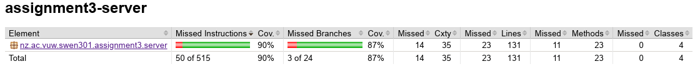
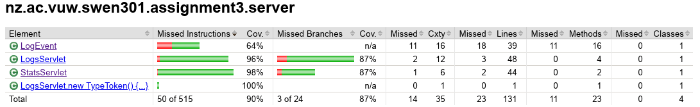
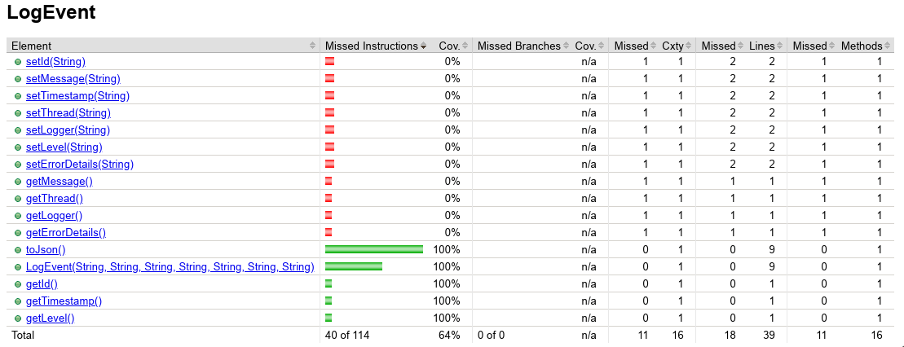
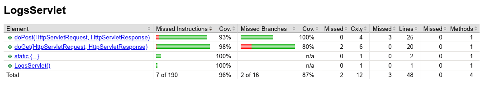
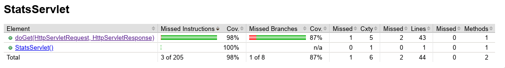
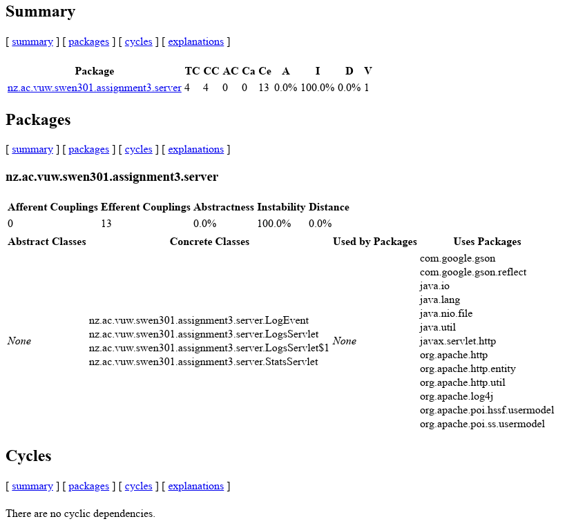

# assignment3-server Report

To run the server type "mvn jetty:run" into the terminal.

## JaCoCo Test Coverage

I attained a total coverage of 90%. This is quite good and gives me some confidence that my testing suite is comprehensive.

Here are the total coverages of the classes, they are very good apart from LogEvent I will explain this next.

LogEvents coverage is so poor because its getters and setters were not used. It seems redundant to specifically
test these methods as they are so simple, being that the just assign or return values.

My LogsServlet coverage is very good giving me some confidence that it is thoroughly tested. The uncovered code is 
error cases which should be unreachable.

My StatsServlet coverage is similar to that of my LogsServlet and its uncovered code is error cases too.

## JDepend Analysis

Above is the jDepend report generated for my software. We can see my software depends on 13 packages and no packages depend on it.
There are no cycles which is good as they are very for software stability.

## Spotbugs Analysis

Initially I got the following bugs.

[ERROR] nz.ac.vuw.swen301.assignment3.server.LogsServlet.ids isn't final but should be  
[ERROR] nz.ac.vuw.swen301.assignment3.server.LogsServlet.logs isn't final but should be  
[ERROR] Exceptional return value of java.io.File.delete() ignored in nz.ac.vuw.swen301.assignment3.server.StatsServlet.doGet(HttpServletRequest, HttpServletResponse)  
[ERROR] nz.ac.vuw.swen301.assignment3.server.StatsServlet.doGet(HttpServletRequest, HttpServletResponse) makes inefficient use of keySet iterator instead of entrySet iterator  

I fixed the first two as they were quick easy fixes and were very surface level. The other two "bugs" I ignored as they were
more deeply rooted in my software and changing them could cause more problems than they solve.